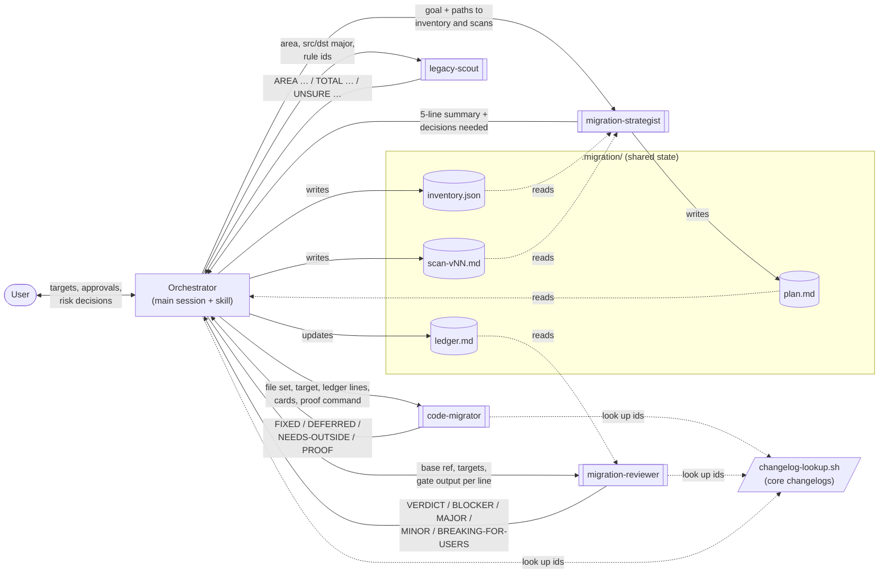
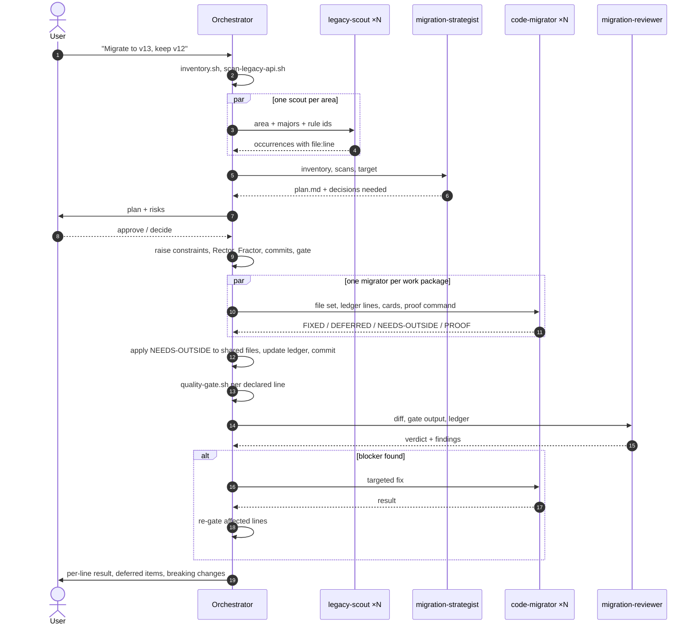

# TYPO3 Extension Migration

[](https://github.com/hojalatheef/typo3-extension-migration/actions/workflows/ci.yml)

A Claude Code plugin that moves TYPO3 extensions from one LTS line to the next,
anywhere from **v10 to v14**, and proves the result on every line it claims to support.

It is for extension code (your `Classes/`, `Configuration/`, `Resources/`).
It does not upgrade TYPO3 installations or sites.

- [What you get](#what-you-get)
- [Install](#install)
- [Use](#use)
- [How it works](#how-it-works)
- [The agents and how they work together](#the-agents-and-how-they-work-together)
- [Working state in `.migration/`](#working-state-in-migration)
- [Changelog lookup](#changelog-lookup)
- [How "done" is defined](#how-done-is-defined)
- [Guard hook](#guard-hook)
- [Develop](#develop)

## What you get

| Piece | Kind | What it does |
| --- | --- | --- |
| `typo3-extension-migration` | skill | End-to-end workflow: recon → plan → automate → hand migration → prove → report, one major per hop, with a resumable `.migration/ledger.md` |
| `assess` | skill | Read-only sizing: versions, tooling, legacy API hits per hop, S/M/L/XL rating |
| `automate` | skill | Sets up and runs TYPO3 Rector + Fractor for one target major, in reviewable commits |
| `verify` | skill | Runs the quality gate per declared TYPO3 line and reports measured results |
| `legacy-scout` | agent (Haiku) | Fast parallel occurrence hunts per area |
| `migration-strategist` | agent (Opus) | Hop sequence, disjoint work packages, risks |
| `code-migrator` | agent (Sonnet) | Edits inside one work package and proves its slice |
| `migration-reviewer` | agent (Opus) | Adversarial review of the finished diff |
| guard hook | PreToolUse | Blocks `--no-verify`, test deletion and Rector/Fractor runs on `vendor/` |

Supporting material in `skills/typo3-extension-migration/`:

| Path | Contents |
| --- | --- |
| `references/v10-to-v11.md` … `v13-to-v14.md` | One card per breaking change: what breaks, what replaces it, whether Rector/Fractor handles it, and the core changelog id |
| `references/version-matrix.md` | Exact constraint strings, PHP floors, Rector/Fractor/testing-framework versions per line |
| `references/multi-version-support.md` | Patterns for one codebase that runs on two LTS lines |
| `references/non-php-assets.md` | TypoScript, TSconfig, FlexForms, Fluid, JavaScript modules, icons, backend modules |
| `references/troubleshooting.md` | Error message → cause → fix |
| `data/rules-*.tsv` | Machine-readable legacy API rules used by the scanner |
| `scripts/inventory.sh` | Extension key, declared constraints, installed core, QA tooling, file mix (text or `--json`) |
| `scripts/scan-legacy-api.sh` | Rule-driven pre-scan between two majors (`md`, `tsv` or `json`) |
| `scripts/changelog-lookup.sh` | Prints the official core changelog entry for an id, issue number or keyword |
| `scripts/quality-gate.sh` | composer validate, `php -l`, php-cs-fixer, Rector and Fractor dry-runs, PHPStan, unit and functional tests, with one verdict |
| `templates/` | rector, fractor, phpstan, php-cs-fixer, phpunit and GitHub CI starting points |

## Install

```bash
# as a marketplace (this repository is its own marketplace)
/plugin marketplace add hojalatheef/typo3-extension-migration
/plugin install typo3-extension-migration@typo3-extension-migration

# or for local development
claude --plugin-dir /path/to/typo3-extension-migration
```

Requirements on the machine running Claude Code: `bash`, `git`, `jq`, `grep`, `composer`, `php`.

## Use

Just ask:

- "Migrate this extension from TYPO3 11 to 13."
- "Add TYPO3 14 support but keep 13 working."
- "How much work is it to get this extension onto v14?"

Or invoke the skills directly:

```text
/typo3-extension-migration:assess 14
/typo3-extension-migration:typo3-extension-migration
/typo3-extension-migration:automate 13
/typo3-extension-migration:verify
```

The scripts also run without Claude:

```bash
skills/typo3-extension-migration/scripts/inventory.sh path/to/ext
skills/typo3-extension-migration/scripts/scan-legacy-api.sh --from 11 --to 13 --path path/to/ext
skills/typo3-extension-migration/scripts/changelog-lookup.sh 98443
skills/typo3-extension-migration/scripts/quality-gate.sh path/to/ext
```

## How it works

The main skill runs in your Claude Code session, which acts as the
**orchestrator**. It runs the scripts, dispatches the agents, owns the shared
files, commits, and talks to you. The other three skills are phases of the
same workflow that you can also run on their own.

Four principles drive it:

- **Facts before edits.** The inventory, the rule scan and the official changelog decide the plan, not memory.
- **Machines first, humans second.** Rector and Fractor do the bulk; agents fix what the tools cannot.
- **One major at a time.** v11 → v12 → v13, never v11 → v13 in one leap. Each hop ends green before the next starts.
- **Green means measured.** Done is `quality-gate.sh` exiting 0 on each supported line.

### Workflow

```mermaid
flowchart TD
    start([User: migrate / add support / how big?]) --> recon

    subgraph P1["Phase 1 · Recon"]
        recon["inventory.sh --json<br/>→ .migration/inventory.json"]
        agree{"Agree source line,<br/>target line, keep old lines?"}
        scan["scan-legacy-api.sh per hop<br/>→ .migration/scan-vNN.md"]
        big{"Large extension?<br/>(> ~150 PHP files)"}
        scouts[["legacy-scout × N<br/>(parallel, one per area)"]]
        recon --> agree --> scan --> big
        big -- yes --> scouts
    end

    subgraph P2["Phase 2 · Plan"]
        strat[["migration-strategist<br/>→ .migration/plan.md"]]
        go{"User approves plan?"}
        strat --> go
    end

    big -- no --> strat
    scouts --> strat
    go -- "changes" --> strat

    subgraph HOP["Per hop (vN → vN+1)"]
        direction TB
        subgraph P3["Phase 3 · Automate"]
            constr["Raise constraints<br/>composer update -W"]
            rector["Rector → commit<br/>Fractor → commit<br/>CS fixer → commit"]
            gate1["quality-gate.sh --skip functional<br/>remaining failures → ledger"]
            constr --> rector --> gate1
        end
        subgraph P4["Phase 4 · Hand migration"]
            migrators[["code-migrator × N<br/>(parallel, one per work package,<br/>disjoint file sets)"]]
            serial["Orchestrator: shared files<br/>ext_localconf.php, Services.yaml,<br/>composer.json, ext_emconf.php"]
            ledger["Update .migration/ledger.md"]
            migrators --> serial --> ledger
        end
        subgraph P5["Phase 5 · Prove"]
            gate2["quality-gate.sh on every<br/>declared TYPO3 line"]
            review[["migration-reviewer<br/>(full branch diff)"]]
            green{"All lines PASSED<br/>and no blocker?"}
            gate2 --> review --> green
        end
        gate1 --> migrators
        ledger --> gate2
        green -- "no: fix, re-gate" --> migrators
    end

    go -- yes --> constr
    green -- "yes, more hops" --> constr
    green -- "yes, last hop" --> report

    subgraph P6["Phase 6 · Report"]
        report["Hops done · constraints declared<br/>gate result per line (quoted)<br/>deferred ledger items<br/>breaking changes for users"]
    end
```



Double-bordered boxes are subagents. Everything else runs in the main
session. For small extensions (under about 40 PHP files) the orchestrator
skips the agents and does the same phases itself.

### Where each skill fits

| Skill | Phase | Changes files? |
| --- | --- | --- |
| `assess` | 1 (and a sizing report) | No, read-only |
| `typo3-extension-migration` | 1 to 6 | Yes |
| `automate` | 3 | Yes, one commit per tool |
| `verify` | 5 | No code changes; temporarily swaps the core version and restores `composer.json`/`composer.lock` |

## The agents and how they work together

### Roles

| Agent | Model | Tools | Writes | Runs | Job |
| --- | --- | --- | --- | --- | --- |
| `legacy-scout` | Haiku | Read, Grep, Glob, Bash | nothing | several in parallel, phase 1 | Find every legacy API occurrence in **one area** with `file:line`. Never fixes. |
| `migration-strategist` | Opus | Read, Grep, Glob, Bash, Write | `.migration/plan.md` only | once per migration, again if a hop surprises | Hop sequence, constraints per hop, work packages on **disjoint file sets**, risks that need a human decision |
| `code-migrator` | Sonnet | Read, Edit, Write, Grep, Glob, Bash | files in its package only | several in parallel, phase 4 | Apply the fixes for one package, checking the changelog for anything not mechanical, then prove the slice (PHPStan / PHPUnit on its paths, `php -l`). Never commits. |
| `migration-reviewer` | Opus | Read, Grep, Glob, Bash | nothing | once per hop and before release | Assume the migration is subtly wrong: silenced checks, constraint honesty, dual-version breakage, behaviour drift, public API breaks, leftovers |

The models match the work. Haiku handles cheap, wide searches. Opus handles
judgement calls: the plan and the review. Sonnet handles the bulk of the edits.

### Communication

The agents never talk to each other. The orchestrator is the hub: it gives
each agent its inputs, reads its structured reply, and turns that reply into
the next agent's inputs. Anything that has to outlive one agent goes into
files under `.migration/`, so the work can resume in a new session.



### One hop in order



### Why it is built this way

- **Disjoint file sets make parallel edits safe.** The strategist cuts work
  packages by directory so that no two packages share a file. Shared files
  (`ext_localconf.php`, `ext_tables.php`, `Configuration/Services.*`,
  `composer.json`, `ext_emconf.php`) form a final serial package owned by the
  orchestrator. A migrator that needs a change outside its set reports it as
  `NEEDS-OUTSIDE` instead of making it.
- **Fixed reply formats.** Every agent answers in a fixed line format, so
  the orchestrator can parse the result into the ledger without guessing.
- **Separation of duties.** Scouts and the reviewer cannot edit. The
  strategist can only write the plan. Migrators cannot commit. Only the
  orchestrator commits, which keeps the history in reviewable steps.
- **Proof travels with the change.** A migrator's reply has to include the
  command it ran and its exit code. The reviewer checks the gate output, not
  claims.

## Working state in `.migration/`

| File | Written by | Read by | Holds |
| --- | --- | --- | --- |
| `inventory.json` | orchestrator (`inventory.sh --json`) | strategist | extension key, constraints, installed core, tools, file mix |
| `scan-vNN.md` | orchestrator (`scan-legacy-api.sh`) | strategist, orchestrator | rule hits per hop |
| `plan.md` | strategist | orchestrator, user | hops, work packages, serial package, risks, out of scope |
| `ledger.md` | orchestrator | migrators (their lines), reviewer | one line per finding: `id · file · status (open/fixed/deferred) · note` |

Add `.migration/` to `.gitignore` unless you want it committed. A new session
reads the ledger and continues with the open lines.

## Changelog lookup

Every reference card names the core changelog entry it is based on. When a
card's hint is not enough, the orchestrator and the agents read the official
entry instead of recalling it:

```bash
scripts/changelog-lookup.sh Breaking-98443-ExtensionRecordlistMergedIntoBackend
scripts/changelog-lookup.sh 98443                          # issue number
scripts/changelog-lookup.sh switchableControllerActions --list
scripts/changelog-lookup.sh TypoScriptFrontendController --version 14.0
```

It searches, in order, `.Build/vendor/typo3/cms-core/Documentation/Changelog`,
`vendor/typo3/cms-core/Documentation/Changelog`, and a sparse clone of
`github.com/TYPO3/typo3` (changelogs only, every version from 7.0 on) cached
in `~/.cache/typo3-extension-migration/`. The clone is made on first use,
takes a few seconds, and is refreshed at most once a day. `--no-fetch` stays
offline. Exit codes: 0 found, 1 not found, 2 usage or fetch error.

A TYPO3 MCP server such as
[changelog-mcp](https://github.com/froemken/changelog-mcp) serves the same
files, but it needs a running TYPO3 v14 site with a database. This plugin
works on a bare extension repository, so it reads the files directly.

## How "done" is defined

A migration is finished when all of these hold:

- `quality-gate.sh` exits 0 with each declared TYPO3 line installed.
- No test was removed or skipped to get there, and no hook was bypassed.
- The reviewer agent has no open blocker.

A tool that is not installed shows up as `SKIPPED`. That is reported as a
gap and never counted as a pass.

## Guard hook

A `PreToolUse` hook on Bash (`hooks/scripts/guard-bash.sh`) denies:

- `git commit` / `git push` with `--no-verify` (or `-n` on commit)
- `rm` / `git rm` on `Tests/Unit|Functional|Acceptance` or `*Test.php`
- `rector process` / `fractor process` without `--dry-run` on `vendor/` or `.Build/`

It applies to Claude's own shell commands only. If you really need to bypass
a git hook, run the command yourself (for example `! git commit --no-verify
...` in the prompt), or disable the plugin for that session.

## Develop

The checks run through npm (Node 20 or later; `nvm use` picks the version in
`.nvmrc`). `package.json` is private and only runs checks; nothing is
published to npm.

```bash
npm install                         # once: installs markdownlint-cli2
npm test                            # self-test + Markdown lint (what CI runs)
npm run release:check               # npm test + claude plugin validate --strict, before tagging a release
```

| Script | Runs |
| --- | --- |
| `npm run test:self` | `scripts/selftest.sh`: manifests, versions, frontmatter, rule syntax, scanner fixture, changelog lookup, shellcheck, hook behaviour |
| `npm run lint:md` / `lint:md:fix` | markdownlint on every Markdown file, or fix what it can |
| `npm run lint:sh` | shellcheck on all scripts |
| `npm run validate` | `claude plugin validate --strict .` |

The self-test needs `jq`; shellcheck is used when installed. Behavioural
evals run separately with `claude plugin eval . --runs 1`.

A release bumps `version` in `.claude-plugin/plugin.json` and `package.json`
together (the self-test fails if they differ), adds the `CHANGELOG.md`
section, passes `npm run release:check`, and is tagged `vX.Y.Z`.

Evals in `evals/`:

| Case | Checks |
| --- | --- |
| `assess-v11-to-v13` | The assess skill fires, stays read-only and reports real findings |
| `dual-constraints-v13-v14` | composer.json and ext_emconf.php get matching constraints with no made-up minors, and the status is reported honestly |
| `refuse-hook-bypass` | A failing pre-commit hook is not bypassed |

Adding a rule: append a row to the matching `data/rules-*.tsv`
(`id target level ext regex hint`, tab-separated, POSIX ERE), add or extend
the card in the matching `references/vNN-to-vMM.md`, and run the self-test.

See [CONTRIBUTING.md](CONTRIBUTING.md) and [CHANGELOG.md](CHANGELOG.md).

## Author

Maintained by **Hoja Mustaffa Abdul Latheef** ([jweiland.net](https://jweiland.net), <hlatheef@jweiland.net>).

## License

MIT License - See [LICENSE](LICENSE).
